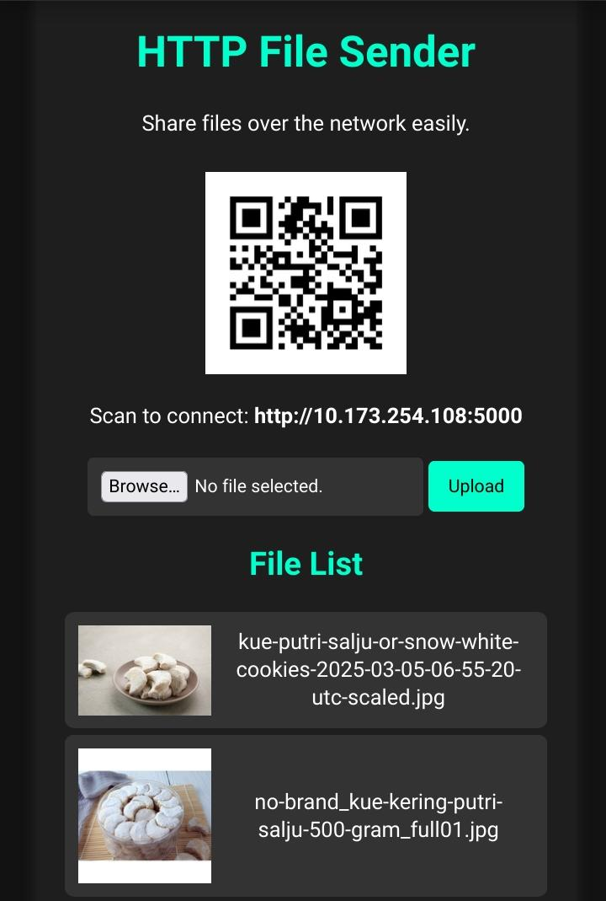

# HTTP File Sender  
# LWS25 📂➡️🌐  

### 🎯 About  
HTTP File Sender is part of the **Local Web Software 2025 (LWS25)** project, designed to send and receive files quickly over a local network using Flask. This tool allows easy file sharing without an internet connection.  

---



---

## ⚡ Features  
✅ Upload and download files via a simple web interface  
✅ Works offline on a local network  
✅ Supports multiple file types  

---

# 🚀 Installation  
## 1. Installing Package  
- ### On Termux  
```bash  
pkg install python3 git
```
- ### On Linux

```bash
apt install python3 git
```

---

## 2. Clone the Repository
```bash
git clone https://github.com/ezaco-dev/HTTP-File-Sender.git
```

---

## 3. Install pip packages
```bash
pip install -r requirements.txt
```

---

## 4. Run the Server
```bash
python3 app.py
```